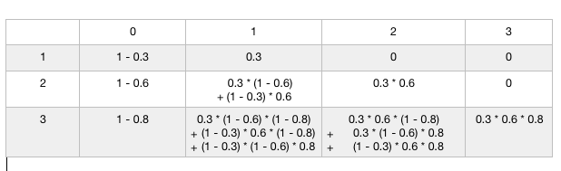

# AtCoder Educational DP Contest

AtCoder has a very nice [educational dynamic programming contest](https://atcoder.jp/contests/dp). I though it would be a good idea to go through them at once, that would be 26 problems in total. Below I will give detailed explanation about each problem and hopefully you could derive some insights and common patterns about how to handle dp problems. 

**My template and meta-code for competitive programming:**

Or you can just use `#include "bits/stdc++.h"`, this would include every headerfile you need.
```cpp
#include <iostream>
#include <sstream>
#include <cstdio>
#include <cmath>
#include <cstring>
#include <cctype>
#include <string>
#include <vector>
#include <list>
#include <set>
#include <map>
#include <unordered_map>
#include <queue>
#include <stack>
#include <algorithm>
#include <functional>
#include <numeric> 
using namespace std; 
#define DEBUG(x) cout << '>' << #x << ':' << x << endl;
#define REP(i,n) for(int i=0;i<(n);i++)
#define FOR(i,a,b) for(int i=(a);i<=(b);i++)
#define FORD(i,a,b) for(int i=(a);i>=(b);i--)
inline bool EQ(double a, double b) { return fabs(a-b) < 1e-9; }
const int INF = 1e9 + 5;
typedef long long ll;
inline int two(int n) { return 1 << n; }
inline int test(int n, int b) { return (n>>b)&1; }
inline void set_bit(int & n, int b) { n |= two(b); }
inline void unset_bit(int & n, int b) { n &= ~two(b); }
inline int last_bit(int n) { return n & (-n); }
inline int ones(int n) { int res = 0; while(n && ++res) n-=n&(-n); return res; }
template<class T> void chmax(T & a, const T & b) { a = max(a, b); }
template<class T> void chmin(T & a, const T & b) { a = min(a, b); }
///////////////////////////////////////////////////////////////////////
```

For the sake of simpilicity, the following code doesn't contain this piece of meta-code.

?>Copy and paste the above code to the front of every file, that would make the code work.

## [A - Frog 1](https://atcoder.jp/contests/dp/tasks/dp_a)

Let `dp[n]` be the minimum cost when frog jumps to stone `n`.
Recursive relation: `dp[i] = min(dp[i - 1] + abs(h[i - 1] - h[i]), dp[i - 2] + abs(h[i - 2] - h[i]));`

```cpp
const int N = 1e5 + 5;

int n;
vector<int> h(N);
vector<int> dp(N);

int main() {
    scanf("%d", &n);
    for (int i = 0; i < n; ++i) scanf("%d", &h[i]);
    dp[0] = 0, dp[1] = abs(h[0] - h[1]);
    for (int i = 2; i < n; ++i) dp[i] = min(dp[i - 1] + abs(h[i - 1] - h[i]), dp[i - 2] + abs(h[i - 2] - h[i]));

    printf("%d\n", dp[n - 1]);
}
```

## [B - Frog 2](https://atcoder.jp/contests/dp/tasks/dp_b)

Basically the same as above, instead of checking the previous two, now we need a `for loop` to calculate the minumum of previous `k` stones.

```cpp
const int N = 1e5 + 5;

int n, k;
vector<int> h(N);
vector<int> dp(N, INT_MAX);

int main() {
    scanf("%d%d", &n, &k);
    for (int i = 0; i < n; ++i) scanf("%d", &h[i]);
    dp[0] = 0;
    for (int i = 1; i < n; ++i) {
        for (int j = 1; j <= k; ++j) {
            if (i - j < 0) break;
            dp[i] = min(dp[i], abs(h[i - j] - h[i]) + dp[i - j]);
        }
    }

    printf("%d\n", dp[n - 1]);
}
```

## [C - Vacation](https://atcoder.jp/contests/dp/tasks/dp_c)

Let `dp[n]` be a vector of three elements:
+ `dp[n][0]` is the max happiness Taro can get at day `n` if he does `activity A`; 
+ `dp[n][1]` is the max happiness Taro can get at day `n` if he does `activity B`;
+ `dp[n][2]` is the max happiness Taro can get at day `n` if he does `activity C`;

The recursive relation is:
```
dp[i][0] = A[i] + max(dp[i - 1][1], dp[i - 1][2]);
dp[i][1] = B[i] + max(dp[i - 1][0], dp[i - 1][2]);
dp[i][2] = C[i] + max(dp[i - 1][0], dp[i - 1][1]);
```

```cpp
const int N = 1e5 + 5;

int n;
vector<int> A(N), B(N), C(N);
vector<vector<int>> dp(N, vector<int>(3));

int main() {
    scanf("%d", &n);
    for (int i = 0; i < n; ++i) {
        scanf("%d%d%d", &A[i], &B[i], &C[i]);
    }
    dp[0][0] = A[0], dp[0][1] = B[0], dp[0][2] = C[0];
    for (int i = 1; i < n; ++i) {
        dp[i][0] = A[i] + max(dp[i - 1][1], dp[i - 1][2]);
        dp[i][1] = B[i] + max(dp[i - 1][0], dp[i - 1][2]);
        dp[i][2] = C[i] + max(dp[i - 1][0], dp[i - 1][1]);
    }

    printf("%d\n", max({dp[n - 1][0], dp[n - 1][1], dp[n - 1][2]}));
}
```

## [D - Knapsack 1](https://atcoder.jp/contests/dp/tasks/dp_d)

Let `dp[i]` be the maximum total value of items with total weight exactly `i`;

```cpp
const int N = 101;
const int W = 1e5 + 5;

int n, w;
int weight, value;
vector<ll> dp(W);

int main() {
    scanf("%d%d", &n, &w);
    ll res = 0;
    for (int i = 0; i < n; ++i) {
        scanf("%d%d", &weight, &value);
        for (int already = w - weight; already >= 0; --already) {
            chmax(dp[already + weight], dp[already] + value);
            chmax(res, dp[already + weight]);
        }
    }
    printf("%lld\n", res);
}
```

## [E - Knapsack 2](https://atcoder.jp/contests/dp/tasks/dp_e)
This problem is almost the same as previous one, but now the `W` is up to `1e9`. We can use the same approach as above and allocate a vector with `1e9 * 4 byte` capacoty, but that will probably get memory exceeded. We want to minimize the space, so that we choose a smaller one from `weight & value` as dimension.

Now `dp[i]` be the minimum total weight of items with total value exactly `i`.
```cpp
const int N = 101;
const ll MAX_LL = 1e18L + 5;

int n, w;
int weight, value;
vector<ll> dp(N * 1000 + 1, MAX_LL);

int main() {
    scanf("%d%d", &n, &w);

    int total_value = N * 1000 + 1;
    dp[0] = 0;
    for (int i = 0; i < n; ++i) {
        scanf("%d%d", &weight, &value);
        for (int value_already = total_value - value; value_already >= 0; --value_already) {
            chmin(dp[value_already + value], dp[value_already] + weight);
        }
    }

    ll res = 0;
    for (ll i = 0; i < total_value; ++i) {
        if (dp[i] <= w) res = max(res, i);
    }
    printf("%lld\n", res);
}
```

## [F - LCS](https://atcoder.jp/contests/dp/tasks/dp_f)
This is a classical dynamic programming problem. 

Create a 2d matrix of size `(n + 1) * (m + 1)`, where `n = s.length(), m = t.length()`.

We need one extra row and column because that saves the trouble when we consider first row and first column. We always compare the current cell and `left-up` cell.
```cpp
string s, t;

int main() {
    cin >> s >> t;
    int n = s.length(), m = t.length();
    vector<vector<int>> dp(n + 1, vector<int>(m + 1, 0));
    for (int i = 1; i < n + 1; ++i) {
        for (int j = 1; j < m + 1; ++j) {
            if (s[i - 1] == t[j - 1]) dp[i][j] = dp[i - 1][j - 1] + 1;
            else dp[i][j] = max(dp[i - 1][j], dp[i][j - 1]);
        }
    }

    int len = dp[n][m];
    string res = "";
    while (n > 0 && m > 0) {
        if (dp[n][m] == dp[n - 1][m]) n--;
        else if (dp[n][m] == dp[n][m - 1]) m--;
        else res = s[n - 1] + res, n--, m--;
    }
    cout << res << endl;
}
```

## [G - Longest Path](https://atcoder.jp/contests/dp/tasks/dp_g)

```cpp
const int N = 1e5 + 5;

int n, m;
vector<int> edges[N];
vector<bool> seen(N);
vector<int> in_degree(N), dist(N);

void dfs(int u) {
    seen[u] = true;
    for (auto& v : edges[u]) {
        dist[v] = max(dist[v], dist[u] + 1);
        in_degree[v]--;
        if (in_degree[v] == 0) dfs(v);
    }
}

int main() {
    scanf("%d%d", &n, &m);
    for (int i = 0; i < m; ++i) {
        int u, v;
        scanf("%d%d", &u, &v);
        edges[u].push_back(v);
        in_degree[v]++;
    }

    for (int i = 1; i <= n; ++i) if (!seen[i] && in_degree[i] == 0) dfs(i);

    int res = 0;
    for (int i = 1; i <= n; ++i) res = max(res, dist[i]);
    printf("%d\n", res);
}
```

?> We use a `in_degree` vector because we want to apply `dfs` on a vertex if and only if all the `in_edges` of this node have been already considered, that is `in_degree[i] == 0`. In this way, we can safely calculate the maximum distance.

## [H - Grid 1](https://atcoder.jp/contests/dp/tasks/dp_h)

This is a extremely standard problem. The relation is describled as follows:
+ if `matrix[i][j] == '#'`, then set `res[i][j]` to 0;
+ otherwise, `res[i][j] = res[i - 1][j] + res[i][j - 1]'` 

```cpp
const int N = 1005;
const int MOD = 1e9 + 7;
char matrix[N][N];
vector<vector<int>> res(N, vector<int>(N, 0));

int main() {
    int row, col;
    scanf("%d%d", &row, &col);
    for (int i = 0; i < row; ++i) {
        scanf("%s", matrix[i]);
    }

    res[1][1] = 1;
    for (int i = 1; i <= row; ++i) {
        for (int j = 1; j <= col; ++j) {
            if (matrix[i - 1][j - 1] == '#') res[i][j] = 0;
            else res[i][j] += res[i - 1][j] + res[i][j - 1];
            res[i][j] %= MOD;
        }
    }

    printf("%d\n", res[row][col]);
}
```

## [I - Coins](https://atcoder.jp/contests/dp/tasks/dp_i)
We can derive the following relationship:
+ each row is `coin number n`
+ each column is the number of coins that has head as outcome
+ value would be the corresponding possibilities



From this diagram, it is easy to get the dp relation:
`dp[i][j] = dp[i - 1][j - 1] * p[i] + (1 - p[i]) * dp[i - 1][j]`, where `i` denotes row, `j` denotes column.

```cpp
const int N = 3005;
double dp[N][N];
vector<double> p(N, 0);
int n;

int main() {
    scanf("%d", &n);
    for (int i = 1; i <= n; ++i) {
        scanf("%lf", &p[i]);
        dp[i][0] = 1 - p[i];
    }
    dp[1][1] = p[1];

    for (int i = 2; i <= n; ++i) {
        for (int j = 1; j <= i; ++j) {
            dp[i][j] = dp[i - 1][j - 1] * p[i] + (1 - p[i]) * dp[i - 1][j];
        }
    }

    int mid = n / 2 + 1;
    double res = 0;
    for (int i = n / 2 + 1; i <= n; ++i) {
        res += dp[n][i];
    }
    printf("%lf\n", res);
}
```

## [J - Sushi](https://atcoder.jp/contests/dp/tasks/dp_j)
// TODO

## [K - Stones](https://atcoder.jp/contests/dp/tasks/dp_k)
`dp[i]` -> True if the first player wins if there are `i` stones left
```cpp
int main() {
    int n, k;
    scanf("%d%d", &n ,&k);
    vector<int> a(n);
    for (int& x : a) scanf("%d", &x);
    vector<bool> dp(k  + 1);
    for (int stones = 0; stones <= k; stones++) {
        for (int x : a) {
            if (stones >= x && !dp[stones - x]) dp[stones] = true;
        }
    }    
    puts(dp[k] ? "First" : "Second");
}
```


## [L - Deque]

This is a standard dp problem. We want to maximum the value Tara can get. Given a vector of numbers, Taro has two choses: either pick the first or last. After that, Tiro will also have two choses (which leaves whatever the smaller remaining back to Taro). The relationship can be described as: 

`max(a[i] + min(helper(a, i + 2, j), helper(a, i + 1, j - 1)), a[j] + min(helper(a, i + 1, j - 1), helper(a, i, j - 2)))`

Instead of re-calculating everything during the recusion, it's better to use a map storing the cache.
```cpp
map<pair<int, int>, ll> memo;

ll helper(vector<int>& a, int i, int j) {
    if (memo.count({i, j}) != 0) return memo[{i, j}];
    if (i > j) return 0;
    if (i == j) return a[i];
    ll res = max(a[i] + min(helper(a, i + 2, j), helper(a, i + 1, j - 1)), a[j] + min(helper(a, i + 1, j - 1), helper(a, i, j - 2)));
    memo[{i, j}] = res;
    return res;
}

int main() {
    int n;
    scanf("%d", &n);
    vector<int> a(n);
    for (int& x : a) scanf("%d", &x);

    ll res = helper(a, 0, a.size() - 1);
    ll total = 0;
    for (int x : a) total += x;
    printf("%lld\n", 2 * res - total);
}
```

## []