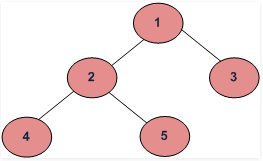

# Tree Traversal

This article gives the stardard template for tree traversal methods: **DFS** (perorder, inorder, postorder) and **BFS**, both iterative and recursive. We will also discuss some variants and related problems regards to tree tarversals.



Depth First Traversal:
+ Inorder traversal: [4, 2, 5, 1, 3]
+ Preorder traversal: [1, 2, 4, 5, 3]
+ Postorder traversal: [4. 5, 2, 3, 1]

Breadth First Traversal: [1, 2, 3, 4, 5]

Below is the template code for traversing trees.

## Traversal

### [Leetcode 144. Binary Tree Preorder Traversal](https://leetcode.com/problems/binary-tree-preorder-traversal/)
**Recursive**
```cpp
void helper(TreeNode* root, vector<int>& res) {
    if (!root) return;
    res.push_back(root->val);
    helper(root->left, res);
    helper(root->right, res);
}

vector<int> preorderTraversal(TreeNode* root) {
    vector<int> res;
    helper(root, res);
    return res;
}
```

**Iterative**
```cpp
vector<int> preorderTraversal(TreeNode* root) {
    stack<TreeNode*> s;
    vector<int> res;
    while (s.size() || root) {
        if (root) {
            s.push(root);
            res.push_back(root->val);
            root = root->left;
        } else {
            auto node = s.top();
            s.pop();
            root = node->right;
        }
    }
    return res;
}
```

In the recursive approach, the code is pretty self-explantory:
1. First create a `helper` function that allows us write recursive relation.
2. Push the root value to result list.
3. Recursive call left child.
4. Recursive call right child.

This piece of code is highly re-usable. In fact, we'll see later that `inorder` and `postorder` traversal just need to adjust the order of Step 2, 3, 4.

In the iterative approach, the code also makes sense. We create a `stack` to store the intermediate state. The end condition of the `while` loop is both stack is empty and root is `null`.

### [Leetcode 94. Binary Tree Inorder Traversal](https://leetcode.com/problems/binary-tree-inorder-traversal/)
**Recursive**
```cpp
void helper(TreeNode* root, vector<int>& res) {
    if (!root) return;
    helper(root->left, res);
    res.push_back(root->val);
    helper(root->right, res);
}

vector<int> inorderTraversal(TreeNode* root) {
    vector<int> res;
    helper(root, res);
    return res;
}
```

**Iterative**
```cpp
vector<int> inorderTraversal(TreeNode* root) {
    stack<TreeNode*> s;
    vector<int> res;
    while (s.size() || root) {
        if (root) {
            s.push(root);
            root = root->left;
        } else {
            auto node = s.top();
            s.pop();
            res.push_back(node->val);
            root = node->right;
        }
    }
    return res;
}
```

### [Leetcode 145. Binary Tree Postorder Traversal](https://leetcode.com/problems/binary-tree-postorder-traversal/)
**Recursive**
```cpp
void helper(TreeNode* root, vector<int>& res) {
    if (!root) return;
    helper(root->left, res);
    helper(root->right, res);
    res.push_back(root->val);
}

vector<int> postorderTraversal(TreeNode* root) {
    vector<int> res;
    helper(root, res);
    return res;
}
```
**Iterative**
```cpp
vector<int> postorderTraversal(TreeNode* root) {
    stack<TreeNode*> s;
    vector<int> res;
    while (s.size() || root) {
        if (root) {
            s.push(root);
            res.push_back(root->val);
            root = root->right;
        } else {
            auto node = s.top();
            s.pop();
            root = node->left;
        }
    }
    reverse(res.begin(), res.end());
    return res;
}
```
One thing worth noticing is that in the iterative code, we have to reverse the list before we return the result. Since this question requires the return type to be `vector<int>`, otherwise we can use a `queue` and change this line: `res.push_back(root->val)` to `queue.push(root->val)`.

Notice that if you are using python, then this would not be a problem, since the return type would simply be a `list`, and you can safely use `list.insert(0, root.val)` instead of `list.append(root.val)`.

### [Leetcode 102. Binary Tree Level Order Traversal](https://leetcode.com/problems/binary-tree-level-order-traversal/)

BFS is simple, just use a `queue` to store intermediate states.

```cpp
vector<vector<int>> levelOrder(TreeNode* root) {
    if (!root) return {};
    queue<TreeNode*> q;
    vector<vector<int>> res;
    q.push(root);
    
    while (!q.empty()) {
        vector<int> children;
        for (int i = q.size(); i > 0; --i) {
            auto node = q.front();
            q.pop();
            children.push_back(node->val);
            if (node->left) q.push(node->left);
            if (node->right) q.push(node->right);
        }
        res.push_back(children);
    }
    return res;
}
```
A few things need to notice in this code:
1. Since the return type is `vector<vector<int>>`, we need to use a temporary `children` vector inside the while loop.
2. The size of `queue` is constantly changing, that's why we need to use a `for loop` that decrease the index `i`.

### Exercises
Some similar questions leave as exercises. I highly recommand to solve them individually. With the template provided about, they should all be solvable:
+ [Leetcode 107. Binary Tree Level Order Traversal II](https://leetcode.com/problems/binary-tree-level-order-traversal-ii/), [[solution]](solutions/leetcode-107.md)
+ [Leetcode 103. Binary Tree Zigzag Level Order Traversal](https://leetcode.com/problems/binary-tree-zigzag-level-order-traversal/), [[solution]](solutions/leetcode-103.md)
+ [Leetcode 429. N-ary Tree Level Order Traversal](https://leetcode.com/problems/n-ary-tree-level-order-traversal/), [[solution]](solutions/leetcode-429.md)
+ [Leetcode 173. Binary Search Tree Iterator](https://leetcode.com/problems/binary-search-tree-iterator/), [[solution]](solutions/leetcode-173.md)
+ [Leetcode 17. Letter Combinations of a Phone Number](https://leetcode.com/problems/letter-combinations-of-a-phone-number/), [[solution]](solutions/leetcode-17.md)
+ [Leetcode 297. Serialize and Deserialize Binary Tree](https://leetcode.com/problems/serialize-and-deserialize-binary-tree/), [[solution]](solutions/leetcode-297.md)
+ [Leetcode 199. Binary Tree Right Side View](https://leetcode.com/problems/binary-tree-right-side-view/), [[solution]](solutions/leetcode-199.md)
+ [Leetcode 230. Kth Smallest Element in a BST](https://leetcode.com/problems/kth-smallest-element-in-a-bst/), [[solution]](./solutions/leetcode-230.md)
+ [Leetcode 116. Populating Next Right Pointers in Each Node](https://leetcode.com/problems/populating-next-right-pointers-in-each-node/), [[solution]](./solutions/leetcode-116.md)

## Variants and Related Problems

### [Leetcode 114. Flatten Binary Tree to Linked List](https://leetcode.com/problems/flatten-binary-tree-to-linked-list/)

> Given a binary tree, flatten it to a linked list in-place.

**Method 1:** Naive preorder traversal, store them in a vector for later process.
```cpp
void helper(TreeNode* root, vector<TreeNode*>& res) {
    if (!root) return;
    res.push_back(root);
    helper(root->left, res);
    helper(root->right, res);
}

void flatten(TreeNode* root) {
    if (!root) return;
    vector<TreeNode*> res;
    helper(root, res);
    for (int i = 0; i < res.size() - 1; ++i) {
        res[i]->right = res[i + 1];
        res[i]->left = NULL;
    }
}
```

This method traversed the whole tree twice, which is not very efficient.

Better approach is to use a `prev` node to store the result from last recusive call, and make `root->right = prev` in the postorder traversal.

```cpp
TreeNode* prev = NULL;

void flatten(TreeNode* root) {
    if (!root) return;
    flatten(root->right);
    flatten(root->left);
    root->right = prev;
    root->left = NULL;
    prev = root;
} 
```

### [Leetcode 257. Binary Tree Paths](https://leetcode.com/problems/binary-tree-paths/)
> Given a binary tree, return all root-to-leaf paths.

Standard traversal problem. Below is the `BFS` version.
```cpp
typedef pair<string, TreeNode*> node;   // current string, current node

vector<string> binaryTreePaths(TreeNode* root) {
    if (!root) return {};
    queue<node> q;
    q.push(make_pair(to_string(root->val), root));
    vector<string> res;
    
    while (!q.empty()) {
        for (int i = q.size(); i > 0; --i) {
            auto next = q.front();
            q.pop();
            if (next.second->left) q.push(make_pair(next.first + "->" + to_string(next.second->left->val), next.second->left));
            if (next.second->right) q.push(make_pair(next.first + "->" + to_string(next.second->right->val), next.second->right));
            if (!next.second->left && !next.second->right) res.push_back(next.first);
        }
    }
    return res;
}
```

**Method 2: Recurisve DFS solution**
```cpp
    void helper(TreeNode* root, vector<string>& res, string t) {
        if (!root->left && !root->right) {
            res.push_back(t);
            return;
        }
        if (root->left) helper(root->left, res, t + "->" + to_string(root->left->val));
        if (root->right) helper(root->right, res, t + "->" + to_string(root->right->val));
    }
    
    vector<string> binaryTreePaths(TreeNode* root) {
        if (!root) return {};
        vector<string> res;
        helper(root, res, to_string(root->val));
        return res;
    }
```